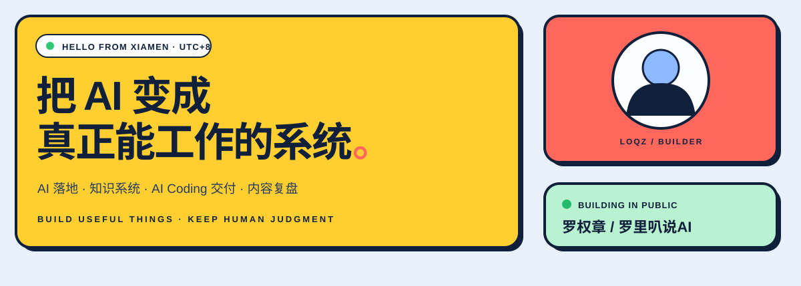
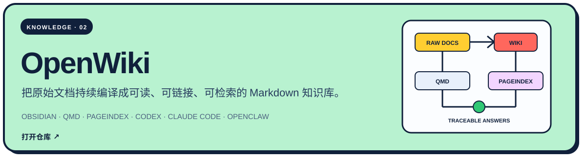
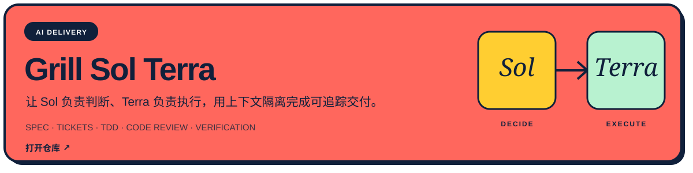
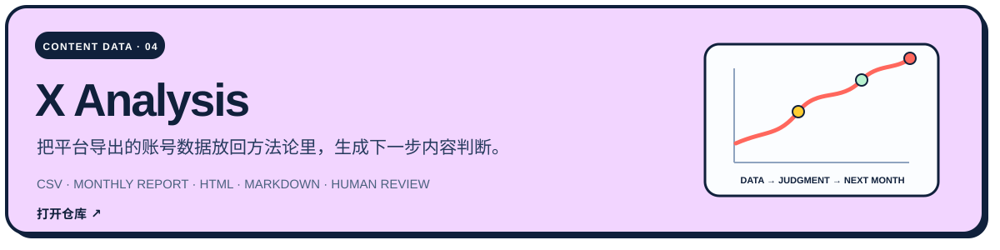
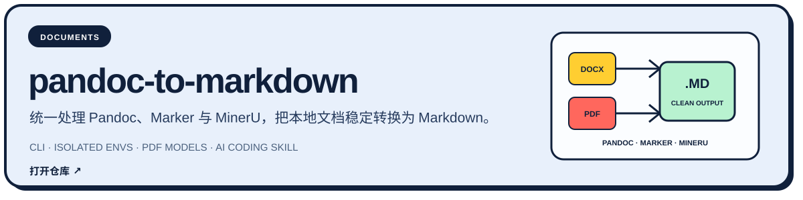
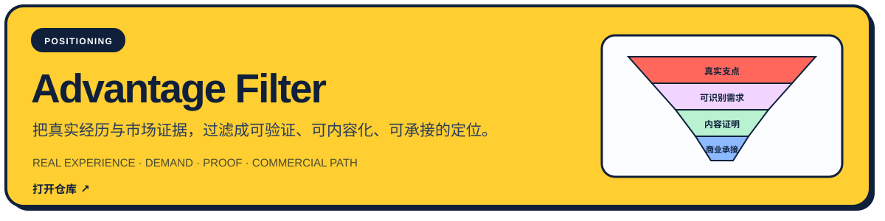
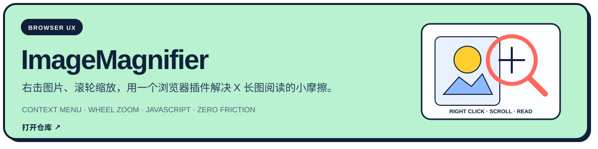

<p align="center">
  <picture>
    <source media="(max-width: 600px)" srcset="./assets/hero-mobile.svg">
    
  </picture>
</p>

<p align="center">
  <a href="https://loqzai.cc"><b>个人网站</b></a>
  &nbsp;·&nbsp;
  <a href="https://x.com/Loqz99156"><b>X / @Loqz99156</b></a>
  &nbsp;·&nbsp;
  <a href="https://github.com/loqz99156?tab=repositories"><b>全部项目</b></a>
</p>


## Selected builds

<a href="https://github.com/loqz99156/openwiki">
  
</a>

<br>

<a href="https://github.com/loqz99156/grill-sol-terra">
  
</a>

<br>

<a href="https://github.com/loqz99156/x-analysis">
  
</a>

<a href="https://github.com/loqz99156/pandoc_to_markdown">
  
</a>

<br>

<a href="https://github.com/loqz99156/advantage-filter">
  
</a>

<br>

<a href="https://github.com/loqz99156/ImageMagnifier">
  
</a>

## Working principles

```text
真实问题  →  人的判断  →  实用工具  →  可验证结果
```

<p align="center">
  <b>把重复交给工具，把判断留给人。</b><br>
  <sub>罗里叭说AI · Builder from Xiamen · UTC+8</sub>
</p>

<a href="./assets/share-card.png">
  
</a>
